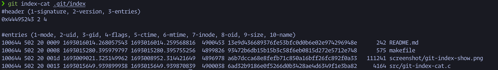
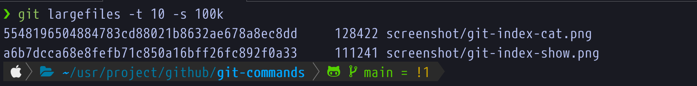

# git commands
Toolset of git extended commands

- git index-cat: show contents of .git/index

# build & install & run
```bash

make
make install
git index-cat .git/index
git largefiles -t 10 -s 100k

```

# screenshot




